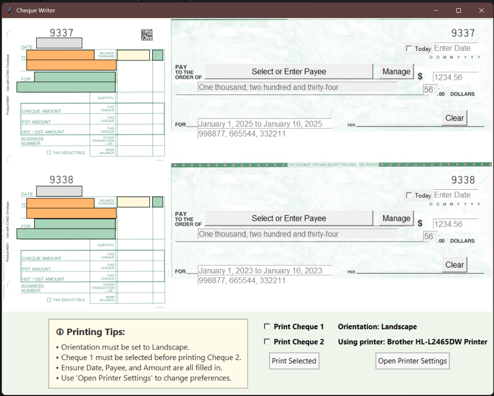

# Cheque Automation & Printing System

A production desktop application used by a local restaurant to automate payroll and supplier cheque processing.
It replaces a manual handwritten workflow with a guided UI, live cheque preview, validation, and printer-aligned output.

## Key Features
- GUI for payee, amount, date, and memo entry with live cheque preview
- Numeric-to-words conversion with input validation and safeguards
- Payee record management and categorization stored in Excel
- Printer integration with DPI scaling and coordinate mapping for precise alignment

## Tech Stack
Python | Tkinter | PIL | OpenPyXL | Win32 API

## Screenshots
<!-- Add 2 images in /docs and link them like below -->



## Setup (Windows)
```bash
pip install -r requirements.txt
python Final_Adv_Year_Updated.py
